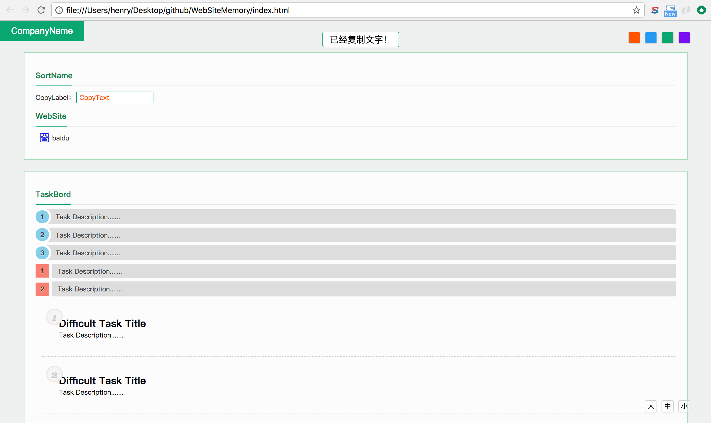

# 网站标签记录

###使用

编辑html，增加A标签。

Demo
```html
<h2 class="title"><span class="company">CompanyName</span></h2>
<div class="sortblock">	
	<h3 class="sort">
		<a class="sorttxt">SortName</a>
	</h3>
	<div class="label">CopyLabel：<input class="copytext" value="CopyText" readonly="true" /></div>
	<h3 class="sort">
		<a class="sorttxt">WebSite</a>
	</h3>
	<a target="_blank" href="http://www.baidu.com" class="link baidu">baidu</a>
</div>
```

在head标签里面配置网站的favicon，然后在a链接上用上class。默认链接样式: 

```css
.baidu{
	background-image:url(http://www.baidu.com/favicon.ico);
}
```
```html
<a target="_blank" href="http://www.baidu.com" class="link baidu">百度一下</a>
```

###效果
